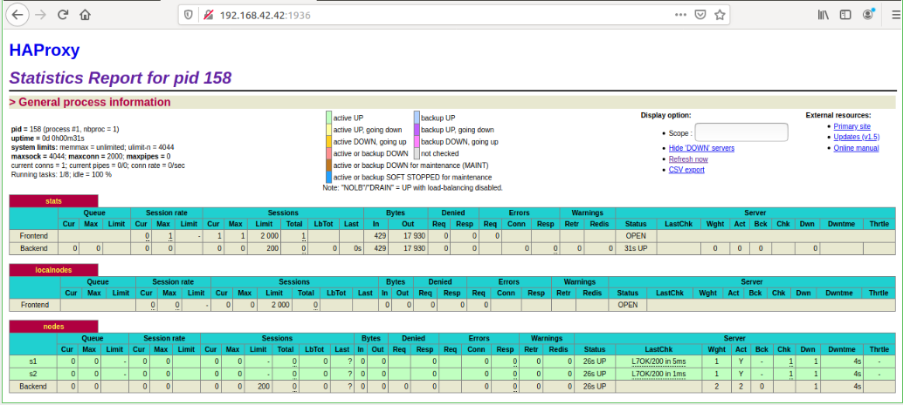

title: Lab 04 - Docker.  Baptiste_Doriane
---


  # Table of contents
  
0. [Identify issues and install the tools](#task-0)
1. [Add a process supervisor to run several processes](#task-1)
2. [Add a tool to manage membership in the web server cluster](#task-2)
3. [React to membership changes](#task-3)
4. [Use a template engine to easily generate configuration files](#task-4)
5. [Generate a new load balancer configuration when membership changes](#task-5)
6. [Make the load balancer automatically reload the new configuration](#task-6)  
7. [Difficulties](#difficulties)
8. [Conlusion](#conclusion)

### <a name="task-0"></a>Task 0: Identify issues and install the tools

#### Identify issues

1. <a name="M1"></a>**[M1]** Do you think we can use the current
   solution for a production environment? What are the main problems
   when deploying it in a production environment?
   
   La solution est statique, On ne peut pas ajouter ou diminuer le nombre de serveurs en foncion de la charge de travail. Si un serveur crash, on n'a pas de solution pour le remettre en route sans avoir à arrêter l'infrastructure globale. Ainsi, on peut se retrouver dans le cas ou un des deux serveurs devra prendre toute la charge de travail ce qui peut impliquer une longue attente de la part d'autres clients.

2. <a name="M2"></a>**[M2]** Describe what you need to do to add new
   `webapp` container to the infrastructure. Give the exact steps of
   what you have to do without modifiying the way the things are
   done. Hint: You probably have to modify some configuration and
   script files in a Docker image.
   
   Dans le fichier /ha/scripts/run.sh, on ajoute la ligne ```sed -i
   s/<s3>/$S3_PORT_3000_TCP_ADDR/g' /usr/local/etc/haproxy/haproxy.cfg```
   
   Il faut aussi rajouter une image docker dans le docker-compose.yml:
   ```
   webapp3:
   		container_name: ${WEBAPP_3_NAME}
   		build:
         context: ./webapp
         dockerfile: Dockerfile
       networks:
         heig:
           ipv4_address: ${WEBAPP_3_IP}
       ports:
         - "4002:3000"
       environment:
            - TAG=${WEBAPP_3_NAME}
            - SERVER_IP=${WEBAPP_3_IP}
   ```
   En dessous de la définition de webapp2.
   
   Dans le fichier .env, il faut rajouter ces lignes:
   ```
	WEBAPP_3_NAME=s3
	WEBAPP_3_IP=192.168.42.33
   ```
   Qui définissent l'addresse IP et le nom du serveur qui sera fetch par le Docker-compose.
   
   Enfin on doit ajouter ce noeud dans le HAProxy (/ha/config/haproxy.cfg): 
   ```
   server s3 ${WEBAPP_3_IP}:3000 check
   ```

3. <a name="M3"></a>**[M3]** Based on your previous answers, you have
   detected some issues in the current solution. Now propose a better
   approach at a high level.
   
   On ne peut pas ajouter un nouveau serveur webapp dynamiquement. La solution serait d'avoir un gestionnaire de webapp dynamique pour HAProxy. On pourrait notifier le load balancer lorsqu'un nouveau serveur est créé et disponible pour être utilisé en tant que noeud. 

4. <a name="M4"></a>**[M4]** You probably noticed that the list of web
    application nodes is hardcoded in the load balancer
    configuration. How can we manage the web app nodes in a more dynamic
    fashion?
    
    On peut utiliser l'outil Serf. Il s'agit d'un système d'orchestration de noeuds décentralisé. Il maintient une liste de web servers pour un load balancer et notifie ce dernier lorsqu'un noeud arrive en ligne ou se déconnecte.

5. <a name="M5"></a>**[M5]** In the physical or virtual machines of a
   typical infrastructure we tend to have not only one main process
   (like the web server or the load balancer) running, but a few
   additional processes on the side to perform management tasks.

   For example to monitor the distributed system as a whole it is
   common to collect in one centralized place all the logs produced by
   the different machines. Therefore we need a process running on each
   machine that will forward the logs to the central place. (We could
   also imagine a central tool that reaches out to each machine to
   gather the logs. That's a push vs. pull problem.) It is quite
   common to see a push mechanism used for this kind of task.

   Do you think our current solution is able to run additional
   management processes beside the main web server / load balancer
   process in a container? If no, what is missing / required to reach
   the goal? If yes, how to proceed to run for example a log
   forwarding process?
   
   Les scripts run.sh qui sont appelés quand on lance les containers Docker des webapp ne démarrent qu'un seul service, mais celui qui est appelé pour HAProxy lance aussi le processus rsyslog. On pourrait donc aussi lancer rsyslog sur les webapp également.

6. <a name="M6"></a>**[M6]** In our current solution, although the
   load balancer configuration is changing dynamically, it doesn't
   follow dynamically the configuration of our distributed system when
   web servers are added or removed. If we take a closer look at the
   `run.sh` script, we see two calls to `sed` which will replace two
   lines in the `haproxy.cfg` configuration file just before we start
   `haproxy`. You clearly see that the configuration file has two
   lines and the script will replace these two lines.

   What happens if we add more web server nodes? Do you think it is
   really dynamic? It's far away from being a dynamic
   configuration. Can you propose a solution to solve this?
   
   Pour ajouter un nouveau serveur, il faut ajouter une ligne sur ce script de config. Ce n'est donc pas totalement dynamique.
   Comme solution on peut utiliser celle décrite précédemment en utilisant l'outil Serf.

#### Install the tools

**Deliverables**:

1. Take a screenshot of the stats page of HAProxy at
   <http://192.168.42.42:1936>. You should see your backend nodes.
   
   

2. Give the URL of your repository URL in the lab report.
 https://github.com/batach31/Teaching-HEIGVD-AIT-2019-Labo-Docker


### <a name="task-1"></a>Task 1: Add a process supervisor to run several processes

**Deliverables**:

1. Take a screenshot of the stats page of HAProxy at
   <http://192.168.42.42:1936>. You should see your backend nodes. It
   should be really similar to the screenshot of the previous task.
   
      


2. Describe your difficulties for this task and your understanding of
   what is happening during this task. Explain in your own words why
   are we installing a process supervisor. Do not hesitate to do more
   research and to find more articles on that topic to illustrate the
   problem.
   
   Nous n'avons eu aucune difficulté en particulier, les instructions étaient bien détaillées.<br/>
   Nous avons modifié les containers docker durant cette tâche afin d'y installer un superviseur de processus qui sera démarré à l'initialisation du container docker.<br/>
   Le superviseur nous permet de faire tourner plusieurs processus en même temps sur un même container, ce qui est contraire à la philosophie de Docker selon laquelle un container = un processus. Le superviseur fonctionne alors comme les fichiers systemd/init.d qui vont superviser quels processus doivent tourner lors du boot d'un ordinateur.


### <a name="task-2"></a>Task 2: Add a tool to manage membership in the web server cluster

**Deliverables**:

1. Provide the docker log output for each of the containers: `ha`,
   `s1` and `s2`. You need to create a folder `logs` in your
   repository to store the files separately from the lab
   report. For each lab task create a folder and name it using the
   task number. No need to create a folder when there are no logs.

   Tout est dans le dossier `/logs/Task2`

2. Give the answer to the question about the existing problem with the
   current solution.
   
   On n'a pas une configuration dynamique. Le cluster n'exsite pas si le container HAProxy n'est pas démarré en premier ou s'il quitte le cluster, alors que le but de Serf est justement de décentraliser.<br/>
   Puisque Self nous le permet, au lieu d'avoir un cluster dans lequel chaque nouveau noeud arrivant se réfère au premier noeud créé, nous pourrions faire en sorte que chaque nouveau noeud se réfère au dernier noeud ayant rejoint le cluster avant lui. Nous aurions donc un cluster décentralisé, se créant en cascade.

3. Give an explanation on how `Serf` is working. Read the official
   website to get more details about the `GOSSIP` protocol used in
   `Serf`. Try to find other solutions that can be used to solve
   similar situations where we need some auto-discovery mechanism.
   
   Le protocole Gossip est un protocole d'échange de messages sur un cluster. Il fonctionne en broadcast de la même manière qu'une infection; le premier noeud envoie un message à un autre, puis ces deux noeuds en envoient un à un autre noeud etc, et ce de manière périodique.
   
   Comme alternative on pourrait utiliser l'outil Consul qui remplit les mêmes fonctionnalités que Serf mais d'une manière centralisée.
   Zookeeper est un outil qui fonctionne aussi de manière centralisée mais demande une configuration plus poussée.


### <a name="task-3"></a>Task 3: React to membership changes

**Deliverables**:

1. Provide the docker log output for each of the containers:  `ha`, `s1` and `s2`.
   Put your logs in the `logs` directory you created in the previous task.

3. Provide the logs from the `ha` container gathered directly from the `/var/log/serf.log`
   file present in the container. Put the logs in the `logs` directory in your repo.
   
Tout est dans le dossier `/logs/Task3`


### <a name="task-4"></a>Task 4: Use a template engine to easily generate configuration files


**Deliverables**:

1. You probably noticed when we added `xz-utils`, we have to rebuild
   the whole image which took some time. What can we do to mitigate
   that? Take a look at the Docker documentation on
   [image layers](https://docs.docker.com/engine/userguide/storagedriver/imagesandcontainers/#images-and-layers).
   Tell us about the pros and cons to merge as much as possible of the
   command. In other words, compare:

  ```
  RUN command 1
  RUN command 2
  RUN command 3
  ```

  vs.

```
RUN command 1 && command 2 && command 3
```
  

  There are also some articles about techniques to reduce the image
  size. Try to find them. They are talking about `squashing` or
  `flattening` images.
  
    Il est mieux d'utiliser la seconde option si l'on veut prendre peu de place. En effet, on ne crée qu'une seule couche dont les commandes sont dépendantes de la précédente, ce qui réduit la taille
  de l'image créée. Dans le premier cas, on crée plusieurs couches, ce qui prends plus de place. Cependant, si l'on veut modifier une de ces couches, on peut le faire sans impacter les autres ce qui donne une recompilation plus rapide.
 Sqash, avec l'option ```--squash```, permet de réduire la taille de l'image une fois construite, ce qui nous permet d'utiliser la première option sans les inconvéniants de taille.

2. Propose a different approach to architecture our images to be able
   to reuse as much as possible what we have done. Your proposition
   should also try to avoid as much as possible repetitions between
   your images.
   
   

3. Provide the `/tmp/haproxy.cfg` file generated in the `ha` container
   after each step.  Place the output into the `logs` folder like you
   already did for the Docker logs in the previous tasks. Three files
   are expected.
   
   In addition, provide a log file containing the output of the 
   `docker ps` console and another file (per container) with
   `docker inspect <container>`. Four files are expected.
   
   Elles se trouvent dans le dossier `/logs/task4`
   
4. Based on the three output files you have collected, what can you
   say about the way we generate it? What is the problem if any?

Le problème est que les logs générés par l'apparition de s1 et de s2 écrasent les logs précédents, ce qui fait que nous n'avons pas une image globale de tous les logs générés jusqu'à présent.

### <a name="task-5"></a>Task 5: Generate a new load balancer configuration when membership changes

**Deliverables**:

1. Provide the file `/usr/local/etc/haproxy/haproxy.cfg` generated in
   the `ha` container after each step. Three files are expected.
   
   In addition, provide a log file containing the output of the 
   `docker ps` console and another file (per container) with
   `docker inspect <container>`. Four files are expected.

2. Provide the list of files from the `/nodes` folder inside the `ha` container.
   One file expected with the command output.

3. Provide the configuration file after you stopped one container and
   the list of nodes present in the `/nodes` folder. One file expected
   with the command output. Two files are expected.
   
    In addition, provide a log file containing the output of the 
   `docker ps` console. One file expected.
   
Les Logs correspondants aux 3 derniers points se trouvent dans `/Logs/Task5`

4. (Optional:) Propose a different approach to manage the list of backend
   nodes. You do not need to implement it. You can also propose your
   own tools or the ones you discovered online. In that case, do not
   forget to cite your references.

### <a name="task-6"></a>Task 6: Make the load balancer automatically reload the new configuration

**Deliverables**:

1. Take a screenshots of the HAProxy stat page showing more than 2 web
   applications running. Additional screenshots are welcome to see a
   sequence of experimentations like shutting down a node and starting
   more nodes.
   
   Nous n'avons pas réussi à faire run haproxy et donc aller sur 192.168.42.42 pour cette partie, nous avons néanmoins mis les logs pour docker ps.
   
   Also provide the output of `docker ps` in a log file. At least 
   one file is expected. You can provide one output per step of your
   experimentation according to your screenshots.
   
2. Give your own feelings about the final solution. Propose
   improvements or ways to do the things differently. If any, provide
   references to your readings for the improvements.
   
   La solution finale nous parait correcte, théoriquement (nous n'avons pas pu tester) l'ajout/la suppression de serveurs se fait dynamiquement ce qui est souhaitable.
   Une amélioration pourrait être d'avoir plusieurs load balancer haproxy afin d'avoir du soutien en cas de crash d'un de ces derniers.

3. (Optional:) Present a live demo where you add and remove a backend container.

### <a name="difficulties"></a>Difficulties

Le point 6 n'ayant pas fonctionné, il s'agissait là de notre seule difficulté, cependant le labo étant conséquent, nous n'avons pas eu le courage de revenir dans tous les fichiers pour voir si quelque chose manquait.
Néanmoins le laboratoire est bien expliqué et nous sommes bien guidés à travers les étapes.

### <a name="conclusion"></a>Conclusion

Nous avons pu: 
- Bien nous familiariser avec les commandes Docker, comment bien build des images, les personnaliser etc.
- Comprendre comment rendre un load-balancer dynamique.
- Comprendre les principes de supervision avec Docker.
- Comprendre comment créer un réseau décentraliser.